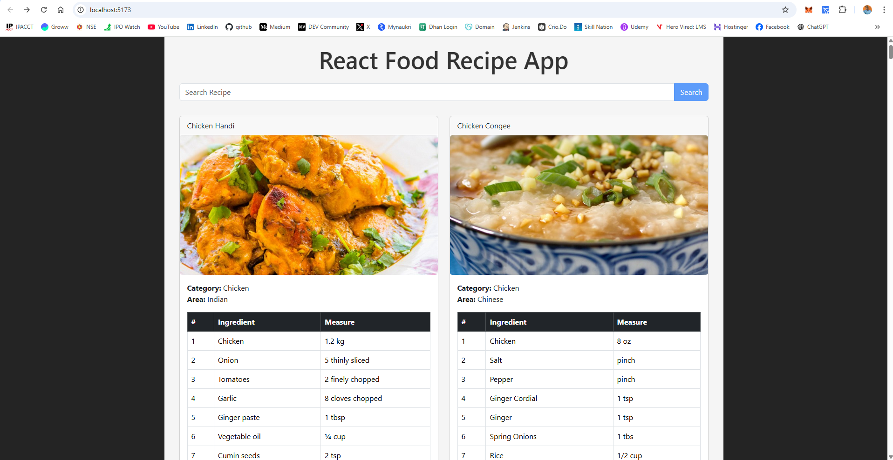

# React Food Recipe App

A simple React application that allows users to search for food recipes using [TheMealDB API](https://www.themealdb.com/api.php).  
The app fetches recipes based on user input and displays them in a clean card layout with details.

## Features

- Search recipes by keyword (e.g., chicken, pasta, etc.)
- Responsive design using React Bootstrap
- Displays recipe details with images and instructions
- Loading spinner while fetching data
- Error handling with user-friendly messages
- No recipes found message if the search returns no results
- Supports keyboard "Enter" key for search

## Live Demo

[Live Demo on Vercel](https://react-food-recipe-app-theta.vercel.app/)

## Screenshots

\
> Screenshot of the app

---

## Installation

1. Clone the repository:

```bash
git clone https://github.com/surendergupta/react-food-recipe-app.git
cd react-food-recipe-app
```

Install dependencies:

bash
Copy
Edit
npm install
Run the development server:

bash
Copy
Edit
npm run dev
Open http://localhost:5173 to view the app in your browser.

Technologies Used
React (Functional Components, Hooks)

React Bootstrap for UI components and styling

TheMealDB API for fetching recipe data

Vite as the build tool

File Structure
bash
Copy
Edit
src/
  ├── Components/
  │     └── Recipe/
  │           └── Recipe.jsx        # Recipe card component
  ├── App.jsx                      # Main app component
  ├── App.css                     # Styles
  └── main.jsx                    # React entry point
How to Use
Enter a keyword in the search bar (e.g., "chicken", "pasta").

Click the "Search" button or press "Enter".

Browse through the list of recipes.

If no recipes are found, a friendly message will be shown.

If there is an error fetching data, an error alert will appear.

API Reference
This project uses the free TheMealDB API for recipe data.

Example API endpoint:
https://www.themealdb.com/api/json/v1/1/search.php?s=chicken

Future Improvements
Add pagination or infinite scroll for search results

Implement filters by category, area, or ingredient

Add user favorites or bookmarks

Improve UI with animations and transitions

Add unit and integration tests

License
This project is open-source and available under the MIT License.

Author
